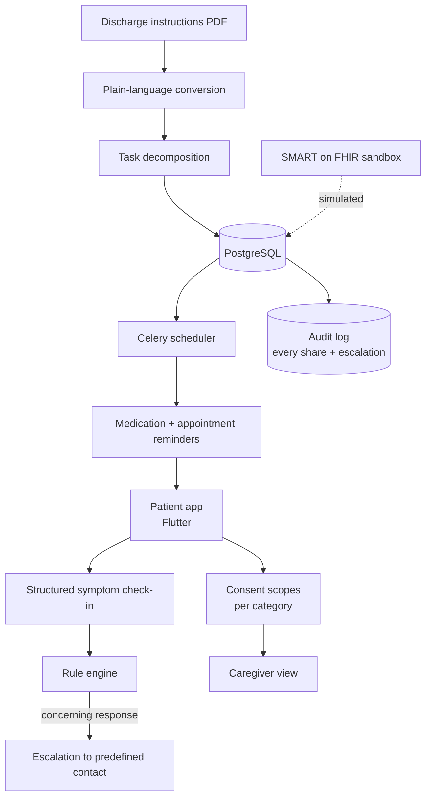

# PulseBridge — Post-Discharge Care Coordination

A privacy-conscious prototype for coordinating post-discharge care.

[](https://github.com/chethanpos23-ui/pulsebridge/actions/workflows/ci.yml)
[](LICENSE)

> **Portfolio case study.** PulseBridge was built as a **MHacks 2025 · First Place, Healthcare Track** project and is
> published here as an educational case study. This repository documents the design, the
> reasoning behind it, and the constraints — read [Limitations](#limitations) before
> assuming any part of it is production-ready.

---

## The Problem

A patient leaves the hospital with a stack of discharge paperwork written at a reading
level most people cannot parse, listing six medications on four different schedules, two follow-up
appointments, and a paragraph of warning signs. They are often medicated, often exhausted, and
frequently alone by the time they read it.

The people who could help — an adult child two states away, a partner at work — have no
structured way to see how things are going without the patient handing over their entire medical
record.

## Our Solution

PulseBridge turns the discharge packet into a daily checklist and gives the patient
a dial, not a switch, for who sees what.

Discharge instructions are converted into plain language and decomposed into scheduled items:
medication reminders, appointment reminders, and structured symptom check-ins. The patient can
invite a caregiver and choose exactly which categories that caregiver sees — medication adherence
but not symptom detail, say, or appointments only.

Concerning check-in responses escalate to a predefined contact through a rule-based engine with an
auditable history of every share and every escalation.

## Demo

<!-- Replace the placeholders below with your own recording and screenshots.
     A 60-90 second video and three screenshots is the format that reads best. -->

| | |
|---|---|
| **Video** | _Add a link to a demo recording_ |
| **Screenshots** | _Add images to `docs/images/` and reference them here_ |
| **Live instance** | Not deployed — see [Local Setup](#local-setup) to run it |

## Features

- Convert discharge instructions into plain language
- Generate medication and appointment reminders
- Track symptoms through structured check-ins
- Allow patients to invite a caregiver
- Control exactly what information is shared
- Provide multilingual instructions
- Escalate concerning responses to a predefined contact
- Maintain an auditable activity history
- Simulate integration with healthcare data standards
- Support large text and voice input

## Architecture



```
pulsebridge/
├── mobile/               # Flutter patient + caregiver app
├── api/                  # Django REST Framework
├── workers/              # Celery reminder + escalation tasks
├── fhir-sandbox/         # SMART on FHIR simulation fixtures
├── privacy/
│   ├── consent-model.md
│   └── data-handling.md
├── docs/
├── tests/
└── README.md
```


Further reading:

- [`docs/architecture.md`](docs/architecture.md)
- [`privacy/consent-model.md`](privacy/consent-model.md)
- [`privacy/data-handling.md`](privacy/data-handling.md)

## Technology

| Layer | Technology |
|---|---|
| Mobile | Flutter |
| API | Django REST Framework |
| Database | PostgreSQL |
| Scheduling | Celery with Redis for reminders and escalation timers |
| Standards | SMART on FHIR sandbox — no production endpoint is ever contacted |
| Messaging | Twilio sandbox |
| Infrastructure | Docker |

## My Contribution

- Designed the consent and sharing model, including per-category caregiver scopes
- Implemented the SMART on FHIR sandbox integration
- Created the rule-based reminder and escalation engine
- Wrote the prototype's privacy documentation and threat notes

## Local Setup

**Prerequisites:** Docker and Docker Compose, or the individual runtimes listed under
[Technology](#technology).

```bash
git clone https://github.com/chethanpos23-ui/pulsebridge.git
cd pulsebridge
cp .env.example .env          # sandbox credentials only — never production
docker compose up --build
```

The Twilio and FHIR integrations are wired to sandbox endpoints. The repository contains no real
patient data, and the seed fixtures are synthetic.

## Testing

The repository ships structural and documentation tests that run on every push:

```bash
python -m pip install pytest
python -m pytest tests -v
```

These verify that the repository keeps the shape its documentation describes — required files
and directories exist, every README section is present, and no credential-shaped strings have
been committed. Application-level test suites belong alongside the code they cover, in each
component directory.

## Limitations

This is a hackathon prototype. The honest constraints:

- This is a prototype. It has not been through clinical validation, HIPAA review, or any regulatory process.
- Plain-language conversion is model-generated and can lose clinically important nuance. The original text is always retained and one tap away.
- The escalation rules are hand-written heuristics, not a triage protocol.
- FHIR integration runs against a sandbox. It has never touched a production health record system.

## Responsible Use

**Medical disclaimer.** PulseBridge is a hackathon prototype. It does not
provide medical advice, diagnose conditions, or replace communication with qualified clinicians.

Do not load real patient data into this application. It was built in a weekend, it has not been
security-reviewed to any healthcare standard, and the consent model — while carefully designed —
is a design exercise rather than a compliance artifact.

If a symptom check-in indicates something concerning, the correct response is to contact a
clinician or emergency services, not to wait for the app's escalation.

## Future Improvements

- Clinician review of the plain-language conversion output
- Formal threat model and third-party security review
- Offline-first check-ins for patients with unreliable connectivity
- Expanded language coverage with human-reviewed translations

## Team

Built by **Chethan Posani** ([@chethanpos23-ui](https://github.com/chethanpos23-ui)) and teammates at
MHacks 2025.

<!-- Add your teammates here with links to their GitHub profiles. Attribution matters —
     if this was a team project, the README should say who did what. -->

My own contribution is listed under [My Contribution](#my-contribution).

## License

[MIT](LICENSE) © 2026 Chethan Posani
