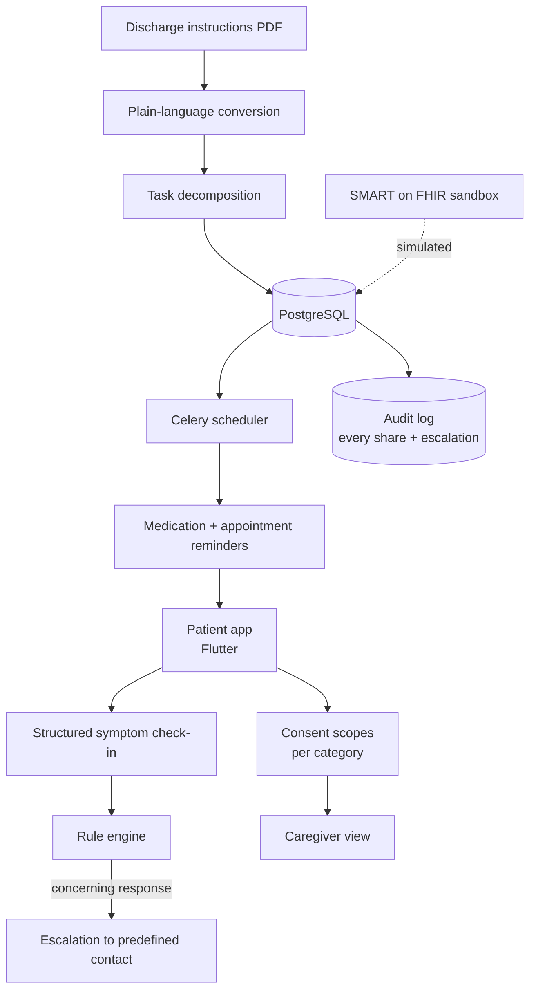

# Architecture

## Overview



## Repository layout

```
pulsebridge/
├── mobile/               # Flutter patient + caregiver app
├── api/                  # Django REST Framework
├── workers/              # Celery reminder + escalation tasks
├── fhir-sandbox/         # SMART on FHIR simulation fixtures
├── privacy/
│   ├── consent-model.md
│   └── data-handling.md
├── docs/
├── tests/
└── README.md
```

## Components

PulseBridge turns the discharge packet into a daily checklist and gives the patient
a dial, not a switch, for who sees what.

Discharge instructions are converted into plain language and decomposed into scheduled items:
medication reminders, appointment reminders, and structured symptom check-ins. The patient can
invite a caregiver and choose exactly which categories that caregiver sees — medication adherence
but not symptom detail, say, or appointments only.

Concerning check-in responses escalate to a predefined contact through a rule-based engine with an
auditable history of every share and every escalation.

## Technology by layer

| Layer | Technology |
|---|---|
| Mobile | Flutter |
| API | Django REST Framework |
| Database | PostgreSQL |
| Scheduling | Celery with Redis for reminders and escalation timers |
| Standards | SMART on FHIR sandbox — no production endpoint is ever contacted |
| Messaging | Twilio sandbox |
| Infrastructure | Docker |

## Design decisions worth explaining

- Designed the consent and sharing model, including per-category caregiver scopes
- Implemented the SMART on FHIR sandbox integration
- Created the rule-based reminder and escalation engine
- Wrote the prototype's privacy documentation and threat notes

## Known constraints

- This is a prototype. It has not been through clinical validation, HIPAA review, or any regulatory process.
- Plain-language conversion is model-generated and can lose clinically important nuance. The original text is always retained and one tap away.
- The escalation rules are hand-written heuristics, not a triage protocol.
- FHIR integration runs against a sandbox. It has never touched a production health record system.

See the [README](../README.md) for the full context, and
[`SECURITY.md`](../SECURITY.md) for how to report a problem.
